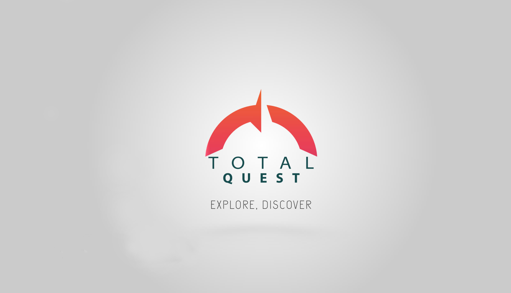
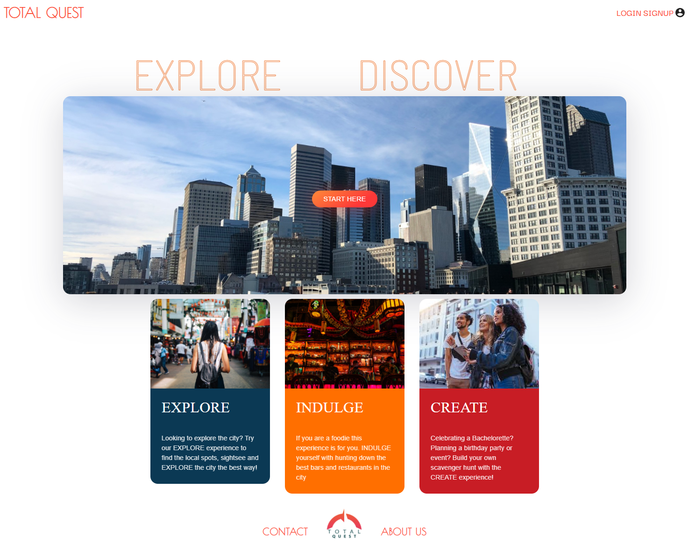

# TOTAL QUEST

### Table of Contents
* [Description](#description)
* [Team Members](#team-members)
* [Technologies Used](#technologies-used)
* [Contact](#contact)
* [Example](#example)
* [Link to Total Quest](#link-to-total-quest) 
***

### Description
Total Quest is an online real-world scavenger hunt application where contestants solve clues to find locations, then scan QR codes with their smart phones or tablets to earn points and log their victories! The contestant may choose to use the scavenger hunts generated by Total Quest or they may make their own by selecting locations from our database. If the contestant is unable to solve their given clue, they can spend points for more clues. If the contestant is unable to solve the location after three clues, they can request the answer. Once they find a location, they will be awarded points and badges, plus any rewards the partnering business offers, and sign the guestbook for that location. After the scavenger hunt is complete, the contestant will gain more points and badges.
***

### Team Members
* [Mark Drummond](https://github.com/mjamesd)
* [Lyss Garcia](https://github.com/lyssg2)
* [Dan Golden](https://github.com/DanPGolden)
* [Justin Meredith](https://github.com/JustinM099)
* [Morgan Sherrill](https://github.com/m-sherrill)
***

### Technologies Used
* React
* React Material UI Library
* GraphQL
* JavaScript
* Node
* Express
* Apollo
* Mongoose
* bcrypt
* emailjs
* Happi.dev API
***

### Contact
If you have any questions about this application or would like to report and issue, please email [Mark Drummond](mailto:mjamesd@gmail.com).
***

### Example
The following image demonstrates the site's application appearance and functionality.

***

### Link to Total Quest
[Total Quest](https://www.totalquest.us/)

